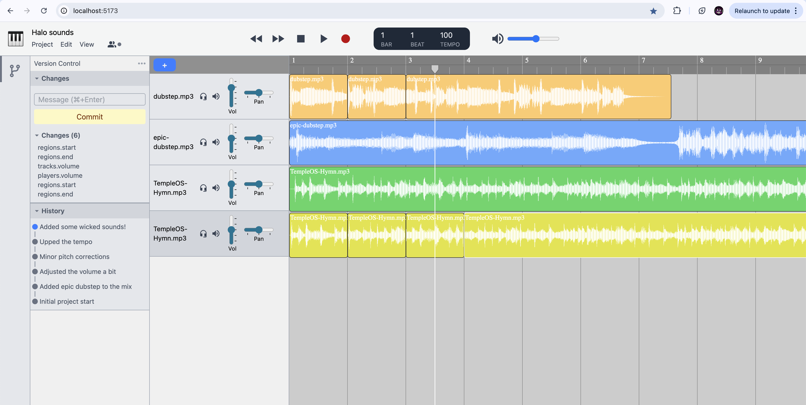

# Cloudband ☁️🎸

Collaborate on making soundtracks like a git project

# Features

* Upload mp3 wav tracks




## Running

You need to have Deno v2.0.0 or later installed to run this repo.

Start both the client app and server in each folder with:

```
$ deno task dev
```